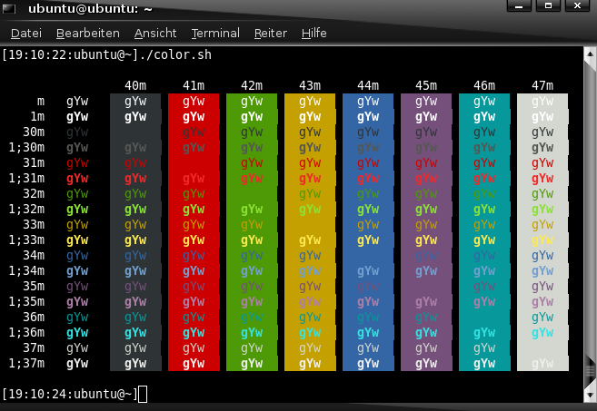

# Shell in general

Show current shell:

```shell
ps -p $$
#or
echo "$0"
```

Show available shells:

```shell
cat /etc/shells
```

Show path of a specific shell:

```shell
type -a bash
```

Change shell to bash:

```shell
bash
```

Change standard shell to bash (current user):

```shell
chsh -s /bin/bash
```

Change standard shell of a specific user to bash:

```shell
chsh -s /bin/bash username
```

--------------------

# Bash

## Bash aliases

The Bash alias is a shortcut for a command. It's often used to automatically execute a command with your standard options, so you don't have to type them every time.  

Syntax: `alias [alias_name]="[command]"`

You can insert the aliases into your _~/.bashrc_ file, or maybe as a better way create a separate ~/.bash_aliases file.  

```shell
nano ~/.bash_aliases
```  

Example ~/.bash_aliases file:

```text
# Alias definitions.
# You may want to put all your additions into a separate file like
# ~/.bash_aliases, instead of adding them directly in ~/.bashrc.
# See /usr/share/doc/bash-doc/examples in the bash-doc package.
# To make shure .bash_aliases will be loaded, you can insert the following code into your ~/.bashrc:
#================================
# if [ -f ~/.bash_aliases ]; then
#     . ~/.bash_aliases
# fi
#================================

eval "$(dircolors -b)"

alias ls="ls --color=auto"
alias l="ls -lahF --time-style=long-iso --color=auto"
alias dir="dir --color=auto"
alias vdir="vdir --color=auto"

alias grep="grep --color=auto"
alias fgrep="fgrep --color=auto"
alias egrep="egrep --color=auto"

alias rm="rm -I"
alias cp="cp -i"
alias mv="mv -i"
```  

List existing aliases:

```shell
alias -p
```

Unset alias:

```shell
unalias [ALIAS_NAME]
# example
uanlias ll
# unset all aliases
unalias -a
```  

## Bash shell colours

- https://wiki.ubuntuusers.de/Bash/Prompt/  

Bash colour chart:  


```shell
nano ~/.bashrc
```  

| Objective | find | change to |
|:---------|:---------|:----------|
| Activate shell colours | `#force_color_prompt=yes` | `force_color_prompt=yes`|
| Change username to red | `\[\033[01;32m\]\u@` | `\[\033[0;31m\]\u@` |

My standard user setting:  
```shell
PS1='${debian_chroot:+($debian_chroot)}\[\033[01;32m\]\u \[\033[00;00m\]@ \[\033[01;37m\]\h\[\033[00m\]:\[\033[01;34m\]\w \$\[\033[00m\] '
``` 

My standard root setting:  
```shell
PS1='${debian_chroot:+($debian_chroot)}\[\033[00;31m\]\u \[\033[00;00m\]@ \[\033[01;37m\]\h\[\033[00m\]:\[\033[01;34m\]\w \$\[\033[00m\] '
``` 

--------------------

# Change tty shortcuts 

Command: [stty](https://manpages.debian.org/bullseye/coreutils/stty.1.en.html) - change and print terminal line settings

List tty settings:  
```shell
stty -a
```  

Change intr (interrupt foreground process) setting to `ctrl`+`G`:  
```shell
stty intr ^G
```  

Delete (undef) lnext (enter the next character quoted) setting:  
```shell
stty lnext ^-
```  

Make the changes persistent by adding commands to `~/.bashrc`:  
```shell
echo -e "\n# remove ctrl-c and ctrl-v binding in tty\nstty intr ^G\nstty lnext ^-" >> ~/.bashrc
```  
