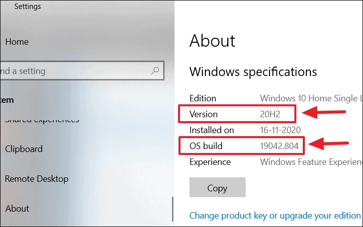
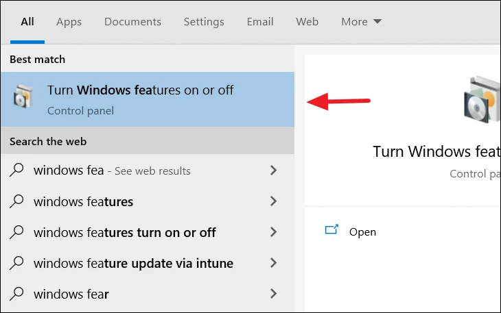
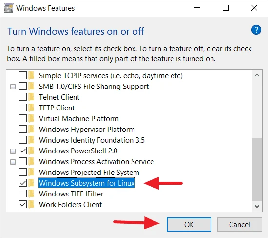
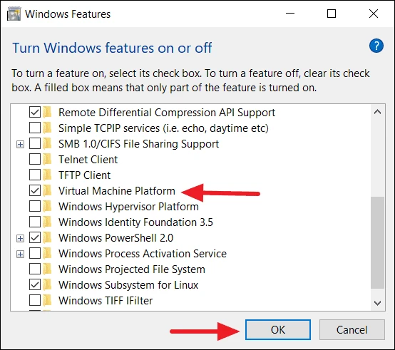

# Windows 10

## 1. Check system requirements

WSL is only supported on both Windows 10 64-bit (from version 1607) and Windows Server 2019.

Open: Settings → System → About
Shortcut: `⊞ Win`+`Pause`

## 2. Enable Windows Subsystem for Linux

There are two types of WSL: WSL 1 runs a translation layer which bridges the gap between Linux kernal and Windows. WSL 2 is the latest and fastest version with supports full Linux kernel and system call compatibility. 

- To run WSL 1, you will need Windows 10 x64 bit systems: Version 1709 or higher, with Build 16215 or higher.
- To run WSL 2 (recommended if possible), you must be running Windows 10 x64 bit systems: Version 1903 or higher, with Build 18362 or higher.

In this Tutorial we activate WSL 2

1. Search "Windows features" in Start Menu (shortcut: `⊞ Win`+`S`
2. Open _"Turn Windows features on and off"_ control panel from the search result. 

(Alternative: Run `⊞ Win`+`R` "optionalfeatures")

3. Enable _"Windows Subsystem for Linux"_. 

 

You can skip restart for now.

4. Enable _"Virtual Machine Platform"_. 

5. Reboot
6. Download and execute [Windows Subsystem for Linux x64 Update](https://wslstorestorage.blob.core.windows.net/wslblob/wsl_update_x64.msi)
7. Set WSL 2 as your default version when installing a new Linux distribution.
	1. Open PowerShell (shortcut `⊞ Win`+`X` → `A`
	2. Execute Command: `wsl –set-default-version 2`
8. Reboot

## Install Linux distribution

1. Open Microsoft Store
2. Find your Linux distribution of choice and install it.
3. Launch Linux from Start Menu `⊞ Win`.
4. The installation starts in a new Shell Window.
5. Complete the installation by following the Linux install wizard.
6. Update your Linux (sudo `apt update && sudo apt upgrade`)

## Use Windows Subsystem for Linux

### Starting Linux Terminal
- U can start your Linux from the Start Menu `⊞ Win`
- U can start a Bash Terminal within Windows:
	- Open the run command `⊞ Win`+`R`
	- Execute `bash`

### Browse in Windows files

Your hard drives are mounted in /mnt: /mnt/c , /mnt/d , ...
