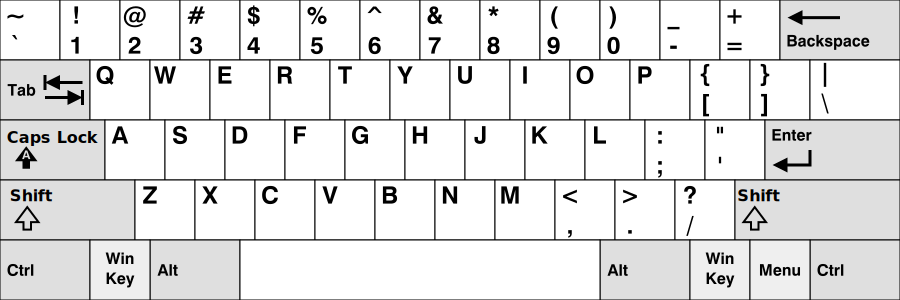
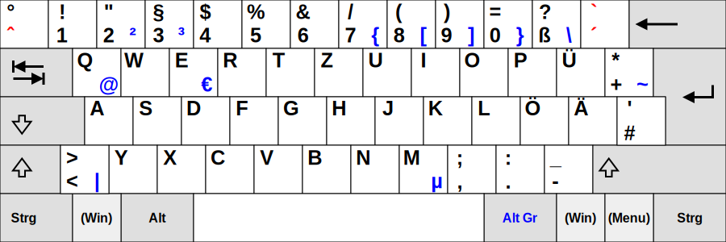

# Links

- [Wikipedia Article](https://en.wikipedia.org/wiki/Keyboard_layout)

# QWERTY (US without AltGr)

# QWERTZ (German default)

------------------------
# MacBook

The MacBook which I sometimes use has a different layout then a PC and there also aren't all symbols which I need printed on the keys. I haven't found a nice pic of the layout, so here is my cheat sheet for the german M1 MacBook I sometimes use.

**Keyboard layout: MacBook M1 DE QWERTZ**

## Keys

| Key          | Description  |
| ------------ | ------------ |
| `⌘` or `cmd` | Command      |
| `ctrl`       | Control      |
| `⌫`          | Backspace    |
| `←`          | Left         |
| `→`          | Right        |
| `↑`          | Up           |
| `↓`          | Down         |
| `⏏`          | Eject-Key    |
| `⇧`          | Shift        |
| `⌥` or `alt` | Option       |
| `⏎`          | Enter/Return |
| `fn`         | Funktions    |
| `⭾`          | Tab          |
| `⏻`          | Power        |
| `⇪`          | Caps Lock    |

## Special signs

| Special Sign | Shortcut              |
| ------------ | --------------------- |
| @            | `alt` + `L`           |
| €            | `alt` + `E`           |
| ®            | `alt` + `R`           |
| ~            | `alt` + `N`           |
| \[           | `alt` + `5`           |
| \]           | `alt` + `6`           |
| {            | `alt` + `8`           |
| }            | `alt` + `9`           |
| /            | `shift` + `7`         |
| \\           | `alt` + `shift` + `7` |
| \|           | `alt` + `7`           | 

## Standard Shortcuts

| Shortcut    | Description |
| ----------- | ----------- |
| `cmd` + `C` | Copy        |
| `cmd` + `V` | Paste       |
| `cmd` + `X` | Cut         |
| `cmd` + `A` | Mark all    |
| `cmd` + `S` | Save        |
| `cmd` + `Z` | Undo        |
| `fn` + `⌫` | Delete      | 

## Useful Shortcuts

| Shortcut                                       | Description                        |
| ---------------------------------------------- | ---------------------------------- |
| `shift` + `cmd` + `Q`                          | Log out                            |
| `alt` + `cmd` + `⏏`                            | Sleep                              |
| `ctrl` + `cmd` + `Q`                           | Lock Screen                        |
| `cmd` + `ctrl` + `⏏`                           | Reboot                             |
| `alt` + `cmd` + `ctrl` + `⏏`                   | Shut Down                          |
| `cmd` + `⭾`                                    | Switch between active applications |
| `cmd` + `shift` + `3`                          | Take screenshot                    |
| `cmd` + `Q`                                    | Quit application                   |
| `alt` + `cmd` + `Esc`                          | Force quit app dialogue            |
| `alt` + `cmd` + `shift` + `Esc` (press longer) | Force quit application             |
| `F3` (Mission Control)                         | Show all windows                   |
| `cmd` + `Spacebar`                             | Spotlight search                   |
| `cmd` + `⌫`                                    | Move to trash                      |
| `cmd` + `shift` + `⌫`                          | Empty trash                        | 
