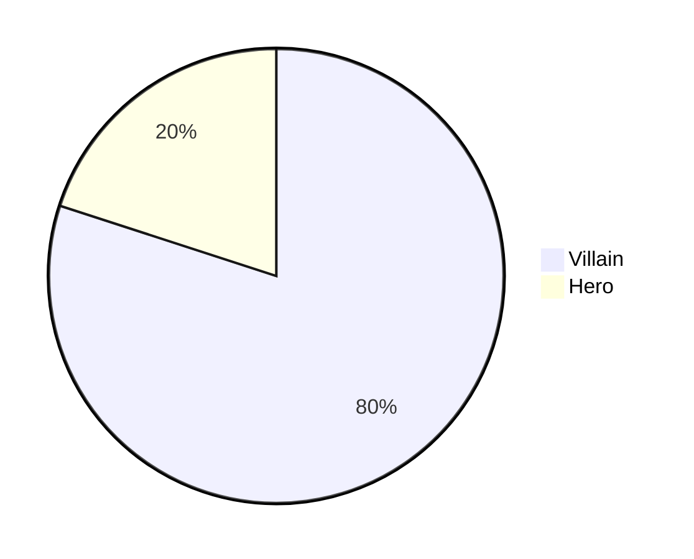

[Online Markdown Guide](https://www.markdownguide.org)

# Headings

```
# Heading 1
## Heading 2
### Heading 3
#### Heading 4
##### Heading 5
```

# Heading 1
## Heading 2
### Heading 3
#### Heading 4
##### Heading 5

----------------

# Text styles

```
The quick brown fox jumps over the lazy dog.

Bold:
**The quick brown fox jumps over the lazy dog.**
__The quick brown fox jumps over the lazy dog.__

Italic:
*The quick brown fox jumps over the lazy dog.*
_The quick brown fox jumps over the lazy dog._

Bold and Italic:
**_The quick brown fox jumps over the lazy dog._**

Strike-through:
~~The quick brown fox jumps over the lazy dog.~~
```

The quick brown fox jumps over the lazy dog.

Bold:
**The quick brown fox jumps over the lazy dog.**
__The quick brown fox jumps over the lazy dog.__

Italic:
*The quick brown fox jumps over the lazy dog.*
_The quick brown fox jumps over the lazy dog._

Bold and Italic:
**_The quick brown fox jumps over the lazy dog._**

Strike-through:
~~The quick brown fox jumps over the lazy dog.~~

------------------

# Blockquotes

```
> The quick brown fox jumps over the lazy dog.
> The quick brown fox jumps over the lazy dog.
> 
> The quick brown fox jumps over the lazy dog.
> 
> The quick brown fox jumps over the lazy dog.
> The quick brown fox jumps over the lazy dog.
>> The quick brown fox jumps over the lazy dog.
>>> The quick brown fox jumps over the lazy dog.
> **The quick brown fox** *jumps over the lazy dog.*
```

> The quick brown fox jumps over the lazy dog.

> The quick brown fox jumps over the lazy dog.
> 
> The quick brown fox jumps over the lazy dog.
> 
> The quick brown fox jumps over the lazy dog.

> The quick brown fox jumps over the lazy dog.
>> The quick brown fox jumps over the lazy dog.
>>> The quick brown fox jumps over the lazy dog.

> **The quick brown fox** *jumps over the lazy dog.*

# Boxed

```
<table><tr><td>The quick brown fox jumps over the lazy dog.</td></tr></table>
```

<table><tr><td>The quick brown fox jumps over the lazy dog.</td></tr></table>

-----------------

# Syntax Highlighting

\`\`\`
public static String monthNames\[\] = {"January", "February", "March", "April", "May", "June", "July", "August", "September", "October", "November", "December"};
\`\`\`

```
public static String monthNames[] = {"January", "February", "March", "April", "May", "June", "July", "August", "September", "October", "November", "December"};
```

\`\`\`java
public static String monthNames\[\] = {"January", "February", "March", "April", "May", "June", "July", "August", "September", "October", "November", "December"};
\`\`\`

```java
public static String monthNames[] = {"January", "February", "March", "April", "May", "June", "July", "August", "September", "October", "November", "December"};
```

-------------

# Tables


```
| Default | Left align | Center align | Right align |
| - | :- | :-: | -: |
| 9999999999 | 9999999999 | 9999999999 | 9999999999 |
| 999999999 | 999999999 | 999999999 | 999999999 |
| 99999999 | 99999999 | 99999999 | 99999999 |
| 9999999 | 9999999 | 9999999 | 9999999 |


| Default    | Left align | Center align | Right align |
| ---------- | :--------- | :----------: | ----------: |
| 9999999999 | 9999999999 | 9999999999   | 9999999999  |
| 999999999  | 999999999  | 999999999    | 999999999   |
| 99999999   | 99999999   | 99999999     | 99999999    |
| 9999999    | 9999999    | 9999999      | 9999999     |


Default    | Left align | Center align | Right align
---------- | :--------- | :----------: | ----------:
9999999999 | 9999999999 | 9999999999   | 9999999999 
999999999  | 999999999  | 999999999    | 999999999  
99999999   | 99999999   | 99999999     | 99999999   
9999999    | 9999999    | 9999999      | 9999999 
```

| Default | Left align | Center align | Right align |
| - | :- | :-: | -: |
| 9999999999 | 9999999999 | 9999999999 | 9999999999 |
| 999999999 | 999999999 | 999999999 | 999999999 |
| 99999999 | 99999999 | 99999999 | 99999999 |
| 9999999 | 9999999 | 9999999 | 9999999 |


| Default    | Left align | Center align | Right align |
| ---------- | :--------- | :----------: | ----------: |
| 9999999999 | 9999999999 | 9999999999   | 9999999999  |
| 999999999  | 999999999  | 999999999    | 999999999   |
| 99999999   | 99999999   | 99999999     | 99999999    |
| 9999999    | 9999999    | 9999999      | 9999999     |


Default    | Left align | Center align | Right align
---------- | :--------- | :----------: | ----------:
9999999999 | 9999999999 | 9999999999   | 9999999999 
999999999  | 999999999  | 999999999    | 999999999  
99999999   | 99999999   | 99999999     | 99999999   
9999999    | 9999999    | 9999999      | 9999999 


```
| A | B | C |
|---|---|---|
| 1 | 2 | 3 |

| A | B | C |
|---|---|---|
| 1 | 2 | 3 <br/> 4 <br/> 5 |
```

| A | B | C |
|---|---|---|
| 1 | 2 | 3 |

| A | B | C |
|---|---|---|
| 1 | 2 | 3 <br/> 4 <br/> 5 |

# Links

```
[Cin-Hub IT-Notes](https://github.com/Cin-Hub/IT-Notes)
```

[Cin-Hub IT-Notes](https://github.com/Cin-Hub/IT-Notes)

```
[Cin-Hub IT-Notes][reference text]

[Cin-Hub IT-Notes][1]

[Cins-GitHub-IT-Notes]

[reference text]: https://github.com/Cin-Hub/IT-Notes
[1]: https://github.com/Cin-Hub/IT-Notes
[Cins-GitHub-IT-Notes]: https://github.com/Cin-Hub/IT-Notes
```

[Cin-Hub IT-Notes][reference text]

[Cin-Hub IT-Notes][1]

[Cins-GitHub-IT-Notes]

[reference text]: https://github.com/Cin-Hub/IT-Notes
[1]: https://github.com/Cin-Hub/IT-Notes
[Cins-GitHub-IT-Notes]: https://github.com/Cin-Hub/IT-Notes

```
[Example of a relative link](../README.md)
```

[Example of a relative link](../README.md)

```
[Tables](#Tables)

[Syntax Highlighting](#Syntax%20Highlighting)
```  

[Tables](#Tables)

[Syntax Highlighting](#Syntax%20Highlighting)

```
Visit https://github.com/
```  

Visit https://github.com/

# Images

```

```


```
![alt text][image]

[image]: https://images.unsplash.com/photo-1598257733238-97cf162c5ae0?ixlib=rb-4.0.3&ixid=MnwxMjA3fDB8MHxwaG90by1wYWdlfHx8fGVufDB8fHx8&auto=format&fit=crop&w=100&q=80
```
![alt text][image]

[image]: https://images.unsplash.com/photo-1598257733238-97cf162c5ae0?ixlib=rb-4.0.3&ixid=MnwxMjA3fDB8MHxwaG90by1wYWdlfHx8fGVufDB8fHx8&auto=format&fit=crop&w=100&q=80

# Lists

```
1. One
2. Two
3. Three
```

1. One
2. Two
3. Three

```
1. First level
    1. Second level
        - Third level
            - Fourth level
2. First level
    1. Second level
3. First level
    1. Second level
```


1. First level
    1. Second level
        - Third level
            - Fourth level
2. First level
    1. Second level
3. First level
    1. Second level
    


```
* 1
* 2
* 3

+ 1
+ 2
+ 3


- 1
- 2
- 3
```

* 1
* 2
* 3

+ 1
+ 2
+ 3


- 1
- 2
- 3


```
- First level
    - Second level
        - Third level
            - Fourth level
- First level
    - Second level
- First level
    - Second level
```

- First level
    - Second level
        - Third level
            - Fourth level
- First level
    - Second level
- First level
    - Second level


```
- [x] Fix Bug 223
- [ ] Add Feature 33
- [ ] Add unit tests
```

- [x] Fix Bug 223
- [ ] Add Feature 33
- [ ] Add unit tests


# Horizontal Rule

```
---
***
___
```

---
***
___

# Diagrams

\`\`\`mermaid
pie
"Villain" : 80
"Hero" : 20
\`\`\`



# Mathematical expressions

```
This is an inline math expression $x = {-b \pm \sqrt{b^2-4ac} \over 2a}$
```
          
This is an inline math expression $x = {-b \pm \sqrt{b^2-4ac} \over 2a}$
          
```
x = {-b \pm \sqrt{b^2-4ac} \over 2a}
```

$$
x = {-b \pm \sqrt{b^2-4ac} \over 2a}
$$
       
          
# Miscellaneous
```
Start of comment
<!--
Lorem ipsum dolor sit amet, consectetur adipiscing elit, sed do eiusmod tempor incididunt ut labore et dolore magna aliqua.
-->
End of comment
```

Start of comment
<!--
Lorem ipsum dolor sit amet, consectetur adipiscing elit, sed do eiusmod tempor incididunt ut labore et dolore magna aliqua.
-->
End of comment

```
*   Asterisk
\   Backslash
`   Backtick
{}  Curly braces
.   Dot
!   Exclamation mark
#   Hash symbol
-   Hyphen symbol
()  Parentheses
+   Plus symbol
[]  Square brackets
_   Underscore`
```

*   Asterisk
\   Backslash
`   Backtick
{}  Curly braces
.   Dot
!   Exclamation mark
#   Hash symbol
-   Hyphen symbol
()  Parentheses
+   Plus symbol
[]  Square brackets
_   Underscore


```
\*   Asterisk
\\   Backslash
\`   Backtick
\{}  Curly braces
\.   Dot
\!   Exclamation mark
\#   Hash symbol
\-   Hyphen symbol
\()  Parentheses
\+   Plus symbol
\[]  Square brackets
\_   Underscore
```

\*   Asterisk
\\   Backslash
\`   Backtick
\{\}  Curly braces
\.   Dot
\!   Exclamation mark
\#   Hash symbol
\-   Hyphen symbol
\(\)  Parentheses
\+   Plus symbol
\[\]  Square brackets
\_   Underscore

```
:octocat:
```

:octocat:


```
@lifeparticle
```

@lifeparticle

```
\#
```

\#
